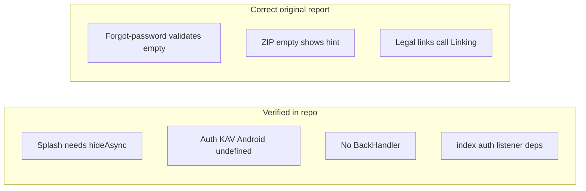

# QA report vs codebase verification

This document amends the original TWOFER QA exploration report using a static review of the repo. It preserves accurate findings, corrects wrong line references and overstated items, and notes what remains runtime-only.

**Scope:** [`app/_layout.tsx`](../app/_layout.tsx), [`app/auth-landing.tsx`](../app/auth-landing.tsx), [`app.json`](../app.json), [`lib/auth-error-messages.ts`](../lib/auth-error-messages.ts), [`components/legal-external-links.tsx`](../components/legal-external-links.tsx), [`app/onboarding.tsx`](../app/onboarding.tsx), [`app/forgot-password.tsx`](../app/forgot-password.tsx), [`app/index.tsx`](../app/index.tsx), [`lib/demo-account.ts`](../lib/demo-account.ts), [`lib/i18n/locales/en.json`](../lib/i18n/locales/en.json), plus spot-checks on tabs, dashboard, account, and create flows.

---

## Verified (matches original report)

| ID | Finding | Evidence |
|----|---------|----------|
| **P0 #1** | Native splash must be dismissed from JS | Repo had no `SplashScreen` / `hideAsync` / `preventAutoHideAsync`. [`app.json`](../app.json) configures `expo-splash-screen` (plugin ~lines 66–76). **Fix applied:** hide splash when [`AppI18nGate`](../components/providers/app-i18n-gate.tsx) finishes hydration. |
| **P1 #4** | No Android back handling on auth | No `BackHandler` usage in the project (at time of audit). |
| **P1 #5** | Android keyboard avoidance off on auth | [`auth-landing.tsx`](../app/auth-landing.tsx): `behavior={Platform.OS === "ios" ? "padding" : undefined}`. |
| **P1 #6** | Weak loading UX on auth | Busy state swaps button copy; no `ActivityIndicator` on that screen. |
| **P1 #7** | No post-signup “check email” flow | Successful `signUp` → `router.replace("/onboarding")` without confirmation copy. |
| **P2 #12** | Onboarding step not persisted | [`onboarding.tsx`](../app/onboarding.tsx): `useState(0)` for `step`; not written to storage. |
| **P2 #13** | “Twofer” vs “TWOFER” | [`en.json`](../lib/i18n/locales/en.json) `onboarding.title`: “Welcome to Twofer”. Auth hero uses `TWOFER` in [`auth-landing.tsx`](../app/auth-landing.tsx). |
| **P2 #14** | Native `Alert` for errors | Auth flows use `Alert.alert` on [`auth-landing.tsx`](../app/auth-landing.tsx). |
| **P3 #15** | Hardware back on onboarding internal steps | No `BackHandler`; steps are local `setStep` only. |
| **P3 #17** | Dark mode incoherent | [`_layout.tsx`](../app/_layout.tsx) uses React Navigation themes; many screens hardcode `#ffffff`. |
| **P3 #18** | Demo password mismatch | [`demo-account.ts`](../lib/demo-account.ts) `demo12345` vs demo prefilled `123456` in [`auth-landing.tsx`](../app/auth-landing.tsx) when demo env is on. |
| **A11y (auth)** | Email/password inputs | [`auth-landing.tsx`](../app/auth-landing.tsx) `TextInput`s lack `accessibilityLabel`. |
| **Arch** | Multiple `getSession()` | Calls across [`app/index.tsx`](../app/index.tsx), [`app/(tabs)/_layout.tsx`](../app/(tabs)/_layout.tsx), [`components/consumer-onboarding-gate.tsx`](../components/consumer-onboarding-gate.tsx), [`app/onboarding.tsx`](../app/onboarding.tsx), etc. |
| **Arch** | `index.tsx` stale `destination` in listener | [`app/index.tsx`](../app/index.tsx): `onAuthStateChange` reads `destination`; `useEffect` deps are `[forceE2E]` only. |
| **Arch** | No global error boundary | Only [`MapErrorBoundary`](../components/map-error-boundary.tsx) on the map tab. |
| **Arch** | `functions.invoke` timeouts | **Fix applied:** standard `timeout` (ms) on invocations via [`lib/functions.ts`](../lib/functions.ts) and call sites. |
| **Supplemental — account** | Logout without confirmation | [`account.tsx`](../app/(tabs)/account.tsx) `signOut` runs immediately from the button. |
| **Supplemental — account** | Post-delete navigation | After delete + sign out, `router.replace("/(tabs)/account")` — problematic if unauthenticated. |
| **Supplemental — consumer** | Business load errors silent | [`loadBusinesses`](../app/(tabs)/index.tsx): on error, log + `setBusinesses([])` without user message. |
| **Supplemental — dashboard** | No pagination on deals/claims | Deals query has no `.limit()`; claims keyed off all deal IDs. |
| **Supplemental — AI compose** | Hardcoded English | e.g. [`create/ai-compose.tsx`](../app/create/ai-compose.tsx) “AI left”, “Step 1 of 2”. |
| **Supplemental — create/quick** | Missing `accessibilityLabel` | Multiple `TextInput`s without labels. |

---

## Corrected or nuanced vs original report

1. **Line numbers / identifiers**  
   - Splash plugin is **[`app.json`](../app.json) ~66–76**, not “line 53”.  
   - Rate-limit copy mapping is **[`friendlyAuthMessage`](../lib/auth-error-messages.ts)** in `lib/auth-error-messages.ts` — not a function named `friendlyError` on [`auth-landing.tsx`](../app/auth-landing.tsx) line 64 (that line is `DEMO_MODE`).

2. **P2 #10 — Forgot-password empty validation — incorrect in original**  
   [`forgot-password.tsx`](../app/forgot-password.tsx): empty email sets `passwordRecovery.errEmailRequired` and shows a `Banner`. The button stays enabled when idle, but submit is validated — not “no feedback.”

3. **P2 #11 — ZIP step “no error feedback” — overstated**  
   [`saveZipAndContinue`](../app/onboarding.tsx): empty ZIP sets `onboarding.zipRequired` into `hint`. Continue is not disabled for empty ZIP, but the hint is shown.

4. **P1 #8 — Footer links “non-functional” — partially disputed**  
   [`LegalExternalLinks`](../components/legal-external-links.tsx) calls `Linking.openURL` when `canOpenURL` is true. “Dead taps” are more likely **environmental** or **no feedback when `canOpenURL` is false**, not missing `openURL`.

5. **P0 #3 — Signup rate limit “silent” — partially disputed**  
   Signup uses `friendlyAuthMessage(error.message, t)`; strings include rate-limit phrases. **Fix applied:** [`friendlyAuthError`](../lib/auth-error-messages.ts) treats HTTP **429** via `error.status` so rate limits still map if the message is empty or odd.

6. **P0 #2 — `Response` status 0 — not proven statically**  
   **Mitigation applied:** [`lib/supabase.ts`](../lib/supabase.ts) wraps `global.fetch` to rethrow a single network message when the runtime throws the invalid-status `Response` error.

7. **Supplemental — account “16+ hardcoded English” — overstated**  
   [`account.tsx`](../app/(tabs)/account.tsx) is mostly `t(...)`. Residual literals (e.g. coordinate placeholder). **Hardcoded English is heavier on onboarding step 0** ([`onboarding.tsx`](../app/onboarding.tsx): “Choose your language”, “Continue”, etc.).

8. **Supplemental — `tab-mode` “swallows persist errors” — imprecise**  
   [`setMode`](../lib/tab-mode.tsx): primary persist is `AsyncStorage.setItem`. The empty `catch` is around **legacy SecureStore delete**, not the main mode write.

9. **Supplemental — settings ZIP `maxLength` — verified**  
   [`settings.tsx`](../app/(tabs)/settings.tsx) ZIP field had no `maxLength`; onboarding ZIP uses `maxLength={10}`.

10. **P2 #9 / P3 #16 / dev error toast** — runtime / dev-build only; not validated from source.

---

## Adjusted issue counts (rough)

- Original totals: **18** device + **19** supplemental = **37**.  
- After corrections: downgrade or close **P2 #10** and **P2 #11** as originally written; **reframe P1 #8** (implementation exists; UX/env gap possible).  
- **P0 #3** and **P0 #2** are less certain from code alone; mitigations are in place as above.

---

## Implementation notes (this branch)

- **Splash:** `expo-splash-screen` `hideAsync()` when i18n gate reports ready.  
- **Network:** Custom `fetch` on the Supabase client for invalid `Response` / status 0 throws; `timeout` on `functions.invoke` for Edge calls; clearer timeout messaging in `parseFunctionError` where applicable.

---

## Mermaid summary

