# Twofer deployment command plan

Command-by-command verification for moving from code readiness to **deployment readiness**. This doc does not deploy anything by itself.

**Related:** [production-deploy-checklist.md](./production-deploy-checklist.md), [deployment-notes.md](./deployment-notes.md), [pilot-smoke-test-checklist.md](./pilot-smoke-test-checklist.md), [multilingual-deals-production-approval-runbook.md](./localization/multilingual-deals-production-approval-runbook.md).

**Legend**

- **READ-ONLY** — Does not change hosted Supabase data, Edge deployments, or EAS cloud builds. (May still read local files or prompt for session.)
- **LOCAL-ONLY** — Updates local Supabase CLI link state under `.supabase/`; does not run SQL on production by itself.
- **PRODUCTION-CHANGING** — Mutates hosted DB schema/data, Edge Function code on Supabase, secrets, or triggers EAS builds.

---

## 1. Supabase project verification

| Step | Command | Classification | Notes |
|------|---------|----------------|-------|
| List accessible projects | `npx supabase projects list` | READ-ONLY | Uses your Supabase login; lists refs and names. |
| Link this repo to a hosted project | `npx supabase link --project-ref <YOUR_PROJECT_REF>` | LOCAL-ONLY | Stores link locally; may prompt for DB password. Does **not** apply migrations. |
| Local stack status (mostly dev) | `npx supabase status` | READ-ONLY (local) | Useful when Docker/local Supabase is running. For hosted truth, use Dashboard or `migration list`. |
| Compare local migration files vs remote history | `npx supabase migration list` | READ-ONLY (remote reads) | Requires `link`. Shows which migrations are applied remotely vs present locally. See [Supabase CLI: migration list](https://supabase.com/docs/reference/cli/supabase-migration-list). |
| Apply pending migrations to linked remote | `npx supabase db push` | **PRODUCTION-CHANGING** | Run **only** after explicit human approval and after `migration list` review. Re-run `migration list` after. |

**Also PRODUCTION-CHANGING (do not run casually):**

- `npx supabase migration repair` (fixes migration history; easy to get wrong)
- Ad-hoc SQL in Dashboard without a tracked migration
- `npx supabase secrets set ...` (sets secret values on the project)

**Comparing local files to remote:** Use Section 2 (ordered filename list) plus `migration list` output and Dashboard **Database → Migrations**.

---

## 2. Supabase migrations

### 2.1 Full local set (109 files, strict filename / timestamp order)

Apply order is **lexicographic sort of the full filename** (standard Supabase CLI behavior).

1. `20250127000000_initial_schema.sql`
2. `20260127000001_add_deal_templates_and_recurring.sql`
3. `20260128120000_business_profile_ai_context.sql`
4. `20260129100000_deal_quality_tier.sql`
5. `20260130120000_business_preferred_locale.sql`
6. `20260323120000_users_read_claimed_deals.sql`
7. `20260324120000_business_coordinates.sql`
8. `20260324180000_business_consumer_profile_fields.sql`
9. `20260325120000_ai_generation_logs.sql`
10. `20260325120100_ai_compose_quota_rpc.sql`
11. `20260325183000_strong_deal_only_guardrail.sql`
12. `20260326120000_consumer_profiles_business_contact.sql`
13. `20260326210000_deal_claims_short_code.sql`
14. `20260327120000_launch_visual_redeem_analytics.sql`
15. `20260328140000_merchant_insights_rpc.sql`
16. `20260330120000_fix_deal_claims_deals_rls_recursion.sql`
17. `20260330140000_deals_public_read_start_time_deal_templates_timezone.sql`
18. `20260331120000_deal_poster_storage_public_read.sql`
19. `20260401120000_add_claim_blocked_reason_mix_to_merchant_business_insights.sql`
20. `20260401150000_update_strong_deal_guardrail_free_item.sql`
21. `20260402120000_push_tokens.sql`
22. `20260402130000_server_set_quality_tier.sql`
23. `20260403120000_consumer_push_prefs.sql`
24. `20260404120000_app_analytics_events_select_business_owner.sql`
25. `20260429120000_business_menu_items.sql`
26. `20260502120000_profiles_app_tab_mode.sql`
27. `20260530120000_business_locations_deal_location.sql`
28. `20260601000000_create_business_profiles.sql`
29. `20260601153000_billing_v4_app_config_and_subscription_rls.sql`
30. `20260601160000_create_subscription_history.sql`
31. `20260630120000_lockdown_deal_claims_client_insert.sql`
32. `20260630123000_enforce_business_locations_cap_insert_rls.sql`
33. `20260701120001_enable_rate_limits_rls.sql`
34. `20260701120002_enable_app_config_rls_backend_only.sql`
35. `20260701130000_fix_deal_claims_rls_recursion_billing_v4.sql`
36. `20260702120000_deal_translation_columns.sql`
37. `20260703120000_add_analytics_business_id_index.sql`
38. `20260703120001_push_token_cleanup.sql`
39. `20260703120002_birthdate_check_constraint.sql`
40. `20260703120003_deal_claims_status_changed_at.sql`
41. `20260703120004_timezone_validation.sql`
42. `20260703120005_claim_race_guards.sql`
43. `20260704120000_business_logo_storage.sql`
44. `20260704120001_enable_deals_realtime.sql`
45. `20260704130000_enforce_max_claims_atomic.sql`
46. `20260705120000_businesses_pii_column_grants.sql`
47. `20260705120002_deal_claims_unique_active.sql`
48. `20260705120003_subscription_history_idempotency.sql`
49. `20260705120004_deal_claims_dashboard_index.sql`
50. `20260705120005_business_profiles_single_row.sql`
51. `20260705120006_realtime_publication_insert_only.sql`
52. `20260705120007_failed_redeem_attempts.sql`
53. `20260705120008_purge_user_data_rpc.sql`
54. `20260705120009_push_token_cleanup_schedule.sql`
55. `20260705130000_reports.sql`
56. `20260706120000_business_invite_gate.sql`
57. `20260706130000_deal_photo_owner_upload_policies.sql`
58. `20260707120000_business_menu_item_sizes.sql`
59. `20260707130000_align_strong_deal_guard_with_client.sql`
60. `20260708120000_deal_viewed_daily_idempotency.sql`
61. `20260708130000_nearby_geo_rpcs.sql`
62. `20260708140000_consumer_deal_alerts_enabled.sql`
63. `20260708150000_weekly_digest_cron.sql`
64. `20260710120000_deal_shares.sql`
65. `20260711120000_profiles_role.sql`
66. `20260712120000_redemption_mode_staff_sessions.sql`
67. `20260713120000_business_claim_notifications.sql`
68. `20260714120000_fix_purge_user_data_columns.sql`
69. `20260715120000_share_lookup_hardening.sql`
70. `20260716120000_deal_claim_counts_rpc.sql`
71. `20260717120000_fix_is_redeemer_session_null_safe.sql`
72. `20260718120000_deal_source_locale_and_english_translation.sql`
73. `20260719120000_demo_content_marker.sql`
74. `20260720120000_cedar_bean_claimable_qa_deal.sql`
75. `20260721120000_deal_wallet_redemption_rules.sql`
76. `20260722120000_ai_generation_cost_ledger.sql`
77. `20260723120000_offer_versions_foundation.sql`
78. `20260724120000_offer_version_publish_rpc.sql`
79. `20260724121000_offer_version_claim_redemption_binding.sql`
80. `20260725120000_ad_generation_media_library.sql`
81. `20260725121000_business_media_import_jobs.sql`
82. `20260726120000_location_billing_entitlements.sql`
83. `20260726123000_deal_credit_consumption_helpers.sql`
84. `20260726124000_deal_credit_reservation_sweep_schedule.sql`
85. `20260726125000_deal_suspension_write_guards.sql`
86. `20260726130000_trial_ending_reminder_events.sql`
87. `20260726131000_introductory_refund_requests.sql`
88. `20260726132000_business_trial_identity_controls.sql`
89. `20260726133000_business_publish_verification_controls.sql`
90. `20260726134000_pause_recurring_deals_on_billing_suspension.sql`
91. `20260726135000_trial_ending_reminder_cron_schedule.sql`
92. `20260726136000_admin_trial_identity_reuse_guard.sql`
93. `20260727120000_ai_provider_circuit_breakers.sql`
94. `20260728120000_ad_localization_storage.sql`
95. `20260728123000_customer_deal_localization_projection.sql`
96. `20260729120000_deal_release_push_events.sql`
97. `20260729121000_deal_release_push_cron_schedule.sql`
98. `20260730120000_deals_owner_delete_ended.sql`
99. `20260730121000_customer_deal_poster_spec_projection.sql`
100. `20260730123000_business_applications.sql`
101. `20260730124000_business_onboarding_workflow.sql`
102. `20260730125000_admin_dashboard_foundation.sql`
103. `20260730126000_website_app_onboarding_sync.sql`
104. `20260730127000_stripe_business_billing_reconnection.sql`
105. `20260730128000_admin_ai_quota_resets.sql`
106. `20260730129000_admin_onboarding_service_role_invite_gate.sql`
107. `20260731120000_business_saved_customers_rpc.sql`
108. `20260801120000_business_repeat_visit_stats.sql`
109. `20260801121000_profiles_app_locale.sql`

### 2.2 Latest migration

**`20260801121000_profiles_app_locale.sql`**

### 2.3 Multilingual rollout migrations

The multilingual approval path depends on the hosted project being current through the migration chain above, including:

- `20260728120000_ad_localization_storage.sql`
- `20260728123000_customer_deal_localization_projection.sql`

The projection migration exposes the customer-safe `customer_deal_localizations(p_deal_ids uuid[], p_locale text)` RPC. It must not grant direct app-role access to `ad_localizations`. See [multilingual-deals-production-approval-runbook.md](./localization/multilingual-deals-production-approval-runbook.md) before asking Dan to approve these migrations.

### 2.4 Deal release push scheduling migrations

The customer release-push path depends on applying these in order:

- `20260729120000_deal_release_push_events.sql`
- `20260729121000_deal_release_push_cron_schedule.sql`

The second migration schedules a five-minute `pg_cron` job that posts to the hosted `send-deal-push` function with a Vault-backed secret. Applying either migration is production-changing and requires explicit approval; after the RLS/idempotency table migration is applied, run `node scripts/probe-rls-smoke.mjs`.

### 2.5 Ended-deal cleanup and poster projection migrations

The current local chain also includes these later migrations:

- `20260730120000_deals_owner_delete_ended.sql`
- `20260730121000_customer_deal_poster_spec_projection.sql`

These add owner deletion for ended deals and expose customer-safe native poster specs for active published deals. Applying either migration is production-changing and requires explicit approval; after applying the poster projection migration, include the customer poster spec RPC in hosted read-only smoke.

### 2.6 Website/admin/billing/AI admin migrations

The current local chain ends with this website/admin sequence:

- `20260730123000_business_applications.sql`
- `20260730124000_business_onboarding_workflow.sql`
- `20260730125000_admin_dashboard_foundation.sql`
- `20260730126000_website_app_onboarding_sync.sql`
- `20260730127000_stripe_business_billing_reconnection.sql`
- `20260730128000_admin_ai_quota_resets.sql`
- `20260730129000_admin_onboarding_service_role_invite_gate.sql`

This starts from `20260730123000_business_applications.sql`, adds `20260730124000_business_onboarding_workflow.sql` for deterministic onboarding tier/risk metadata and field-invite placeholders, adds `20260730125000_admin_dashboard_foundation.sql` for the internal admin allowlist, audit log, launch areas, feature flags, and central publish eligibility helper, adds `20260730126000_website_app_onboarding_sync.sql` for website-to-app profile materialization, membership linkage, field sources, revision history, setup checklist, terms acceptance, and app-safe profile update flow, adds `20260730127000_stripe_business_billing_reconnection.sql` for business billing profiles, subscriptions, billing events, web/admin Stripe session audit tables, sync jobs, reminders, and billing tokens, adds `20260730128000_admin_ai_quota_resets.sql` for admin-only AI quota reset records and reset-aware compose quota display, then adds `20260730129000_admin_onboarding_service_role_invite_gate.sql` so reviewed website/admin onboarding can materialize businesses through service-role Edge Functions while normal client signups remain invite-gated. Public submissions go through `submit-business-application`; admin summary reads go through `admin-dashboard-summary`; admin AI usage and quota resets go through `admin-ai-usage`; admin trial request reviews go through `admin-business-applications`; app onboarding reads and writes go through `get-business-onboarding-context` and `update-business-profile-section`. Web/admin billing starts through `stripe-create-checkout-session`, `stripe-customer-portal-session`, `stripe-ensure-customer`, and `stripe-backfill-customers`; mobile app billing remains closed. Applying any of these migrations is production-changing and requires explicit approval.

### 2.7 Saved customers, repeat visits, and app locale

The current local chain also includes:

- `20260731120000_business_saved_customers_rpc.sql`
- `20260801120000_business_repeat_visit_stats.sql`
- `20260801121000_profiles_app_locale.sql`

These add owner-facing saved-customer and repeat-visit helpers plus `profiles.app_locale` for server-originated localized copy. Applying any of these migrations is production-changing and requires explicit approval.

### 2.8 Duplicate timestamp check

No duplicate timestamp prefixes are present in the current migration directory. Keep future migration prefixes unique; lexicographic order is stable, but duplicate prefixes are an operational footgun.

### 2.9 Command to apply migrations (do not run without explicit approval)

```bash
npx supabase link --project-ref <YOUR_PROJECT_REF>   # if not already linked
npx supabase migration list                          # READ-ONLY: verify pending
npx supabase db push                                 # PRODUCTION-CHANGING
npx supabase migration list                          # confirm all applied
```

---

## 3. Supabase storage

### 3.1 Buckets that should exist

| Bucket | Source migrations | Public read |
|--------|-------------------|-------------|
| `deal-photos` | `20260331120000_deal_poster_storage_public_read.sql`, `20260706130000_deal_photo_owner_upload_policies.sql` | Yes (`public = true`, public SELECT policy) |
| `business-logos` | `20260704120000_business_logo_storage.sql` | Yes (`public = true`, public SELECT policy) |

### 3.2 Dashboard checks

- **Storage → Buckets:** `deal-photos` and `business-logos` exist and are **public**.
- **`deal-photos` object paths:** App uses `deal-photos/<business_id>/<filename>`. RLS for INSERT/UPDATE/DELETE requires the first path segment to match a business owned by `auth.uid()`.
- **`business-logos`:** Policies allow authenticated INSERT/UPDATE; public SELECT for all objects in bucket.

### 3.3 SQL spot-checks (read-only in SQL editor)

```sql
-- Buckets
SELECT id, name, public FROM storage.buckets WHERE id IN ('deal-photos', 'business-logos');

-- Policy names present (adjust if you rename)
SELECT policyname, cmd, roles
FROM pg_policies
WHERE schemaname = 'storage' AND tablename = 'objects'
  AND (
    policyname ILIKE '%deal%' OR policyname ILIKE '%business%logo%'
  );
```

### 3.4 Smoke tests (manual)

See [production-deploy-checklist.md §2](./production-deploy-checklist.md): owner uploads logo; owner uploads deal photo; consumer or logged-out read of public URLs behaves as expected.

---

## 4. Edge Functions

### 4.1 Functions to deploy (repo inventory)

All of the following exist under `supabase/functions/` and have `[functions.<name>]` entries in `supabase/config.toml` (each with `verify_jwt = false` — callers must pass auth headers where required; Stripe webhook uses signature verification).

| Function |
|----------|
| `activate-redemption-mode` |
| `admin-dashboard-summary` |
| `admin-ai-usage` |
| `admin-business-applications` |
| `ai-business-lookup` |
| `ai-compose-offer` |
| `ai-create-deal` |
| `ai-deal-suggestions` |
| `ai-extract-menu` |
| `ai-generate-ad-variants` |
| `ai-generate-deal-copy` |
| `ai-studio-generate-draft` |
| `ai-translate-deal` |
| `begin-visual-redeem` |
| `billing-checkout-redirect` |
| `billing-pricing` |
| `cancel-visual-redeem` |
| `claim-deal` |
| `complete-visual-redeem` |
| `deal-link` |
| `delete-user-account` |
| `exit-redemption-mode` |
| `finalize-stale-redeems` |
| `get-business-onboarding-context` |
| `ingest-analytics-event` |
| `manage-redemption-devices` |
| `owner-redemption-security` |
| `publish-offer-version` |
| `redeem-token` |
| `release-claim` |
| `send-deal-push` |
| `send-trial-ending-reminders` |
| `simulate-subscribe` |
| `staff-redemption` |
| `stripe-backfill-customers` |
| `stripe-cancel-paid-subscription` |
| `stripe-cancel-trial-subscription` |
| `stripe-create-checkout-session` |
| `stripe-customer-portal-session` |
| `stripe-ensure-customer` |
| `stripe-expire-pending-checkout` |
| `stripe-request-introductory-refund` |
| `stripe-webhook` |
| `submit-business-application` |
| `update-business-profile-section` |
| `weekly-deal-digest` |

**Note:** deploy only function folders that exist above and are present in `supabase/config.toml`.

**Shared code:** `supabase/functions/_shared/` is bundled with functions; redeploy functions after changing `_shared/`.

### 4.2 Pilot-critical subset (non-exhaustive)

- **Wallet / redeem:** `claim-deal`, `redeem-token`, `release-claim`, `begin-visual-redeem`, `complete-visual-redeem`, `finalize-stale-redeems` (and `cancel-visual-redeem` if still referenced)
- **Redemption Mode / staff controls:** `activate-redemption-mode`, `exit-redemption-mode`, `staff-redemption`, `manage-redemption-devices`, `owner-redemption-security`
- **Account / compliance:** `delete-user-account`
- **Publishing / telemetry:** `publish-offer-version`, `ingest-analytics-event`
- **Push / scheduled notifications:** `send-deal-push`, `weekly-deal-digest`, `send-trial-ending-reminders`
- **AI (as used by pilot builds):** `ai-generate-ad-variants`, `ai-extract-menu`, `ai-compose-offer`, `ai-generate-deal-copy`, `ai-business-lookup`, `ai-deal-suggestions`, `ai-translate-deal`; `ai-create-deal` is legacy-disabled and should return HTTP 410 if deployed
- **Web business intake/admin sync:** `submit-business-application`, `admin-dashboard-summary`, `admin-ai-usage`, `admin-business-applications`, `get-business-onboarding-context`, and `update-business-profile-section`
- **Billing (web/admin only if charging pilots):** `billing-pricing`, `stripe-create-checkout-session`, `stripe-customer-portal-session`, `stripe-ensure-customer`, `stripe-backfill-customers`, `stripe-webhook`, `billing-checkout-redirect`, `stripe-expire-pending-checkout`, `stripe-cancel-trial-subscription`, `stripe-cancel-paid-subscription`, `stripe-request-introductory-refund`; treat `simulate-subscribe` as **QA-only**

### 4.3 Deploy commands (PRODUCTION-CHANGING — do not run until approved)

Per function:

```bash
npx supabase functions deploy <function-name>
```

Batch (verify your CLI supports this — check `npx supabase functions deploy --help`):

```bash
npx supabase functions deploy
```

---

## 5. Supabase secrets (names only)

Never paste real secret values into tickets or commits.

### 5.1 Required for most Edge behavior

| Secret | Notes |
|--------|--------|
| `SUPABASE_URL` | Often auto-provided on hosted Supabase; confirm present for Deno functions. |
| `SUPABASE_SERVICE_ROLE_KEY` | Server-side admin client. |
| `OPENAI_API_KEY` | Required for AI paths. |

### 5.2 Strongly recommended for product quality

| Secret | Notes |
|--------|--------|
| `GOOGLE_PLACES_API_KEY` | Used by `ai-business-lookup` for Places results. |

### 5.3 Optional model / tuning (names only)

| Secret | Notes |
|--------|--------|
| `OPENAI_MODEL` | Chat model allowlist in `_shared/openai-chat-model.ts`; default `gpt-5.5`, other allowlisted models are explicit overrides. |
| `OPENAI_WHISPER_MODEL` | Voice path in `ai-compose-offer`. |
| `GEMINI_API_KEY` | Required only when Gemini text fallback, independent judging, vision QA fallback, or Gemini image generation is enabled. |
| `GEMINI_TEXT_MODEL` | Gemini structured text model; default `gemini-3.5-flash`. |
| `GEMINI_JUDGE_MODEL` | Gemini independent-judge model; default `gemini-3.5-flash`. |
| `AI_V3_PROVIDER_ROUTER_ENABLED` | Enables the shared OpenAI/Gemini text provider router. |
| `AI_TEXT_PRIMARY_PROVIDER` | Shared text router primary provider; defaults to `openai`. |
| `AI_TEXT_FALLBACK_ENABLED` | Enables text fallback only when the router is enabled; keep `false` in production until the public privacy/subprocessor update is deployed. |
| `AI_TEXT_FALLBACK_PROVIDER` | Shared text fallback provider; defaults to `gemini`. |
| `AI_TEXT_PRIMARY_TIMEOUT_MS` | Shared text primary provider timeout; default `12000`. |
| `AI_TEXT_FALLBACK_TIMEOUT_MS` | Shared text fallback provider timeout; default `14000`. |
| `AI_TRANSIENT_RETRY_MAX` | Shared text transient retry count; capped at `1`. |
| `AI_RETRY_AFTER_FULL_TIMEOUT` | Allows retry after a full primary timeout when explicitly true. |
| `AI_CIRCUIT_BREAKER_ENABLED` | Enables provider circuit-breaker checks with the router; activate only after the circuit-breaker migration is applied. |
| `AI_V3_INDEPENDENT_JUDGE_ENABLED` | Enables Gemini independent judging for ad-variant candidates. |
| `AI_VISION_PRIMARY_PROVIDER` | Image QA primary provider; defaults to `gemini` (set `openai` to run QA on OpenAI). |
| `AI_VISION_FALLBACK_ENABLED` | Enables the other provider as image QA fallback; default `true`. |
| `AI_VISION_PRIMARY_TIMEOUT_MS` | Image QA primary timeout; default `25000`. |
| `AI_VISION_FALLBACK_TIMEOUT_MS` | Image QA fallback timeout; default `14000`. |
| `AI_STOCK_QA_CANDIDATE_LIMIT` | Ranked stock-candidate QA cap; default `3`, maximum `10`. |
| `AI_AD_WEB_SEARCH_ENABLED` | Enables the paid `gpt-4o-search-preview` unfamiliar-item lookup; default `true`, set `false` to disable. |
| `AI_V3_COST_BUDGET_ENABLED` | Enables AI provider cost projection/budget checks. |
| `AI_TEXT_COST_SOFT_LIMIT_USD` | Text cost soft-limit telemetry threshold; default `0.2`. |
| `AI_TEXT_COST_HARD_LIMIT_USD` | Per-text-attempt hard projection limit; default `0.5`. |
| `AI_TOTAL_GENERATION_COST_HARD_LIMIT_USD` | Full generation hard projection limit; default `1`. |
| `AI_REVISION_COST_HARD_LIMIT_USD` | Revision hard projection limit; default `0.35`. |
| `OPENAI_IMAGE_MODEL_DEFAULT` | Default for both generate and edit when role-specific vars unset (`_shared/dalle-image.ts`); allowlisted ids only; invalid → `gpt-image-1`. |
| `OPENAI_IMAGE_MODEL_GENERATE` | Text-to-image / poster generation (`_shared/dalle-image.ts`); falls back to `OPENAI_IMAGE_MODEL_DEFAULT` then `gpt-image-1`. |
| `OPENAI_IMAGE_MODEL_EDIT` | Uploaded-photo edits (`_shared/dalle-image.ts`); falls back to `OPENAI_IMAGE_MODEL_DEFAULT` then `gpt-image-1`. |
| `AI_IMAGE_PROVIDER` | Ad-image primary provider; defaults to `openai`, with `gemini` usable only when `AI_IMAGE_GEMINI_ENABLED=true`. |
| `AI_IMAGE_FALLBACK_PROVIDER` | Ad-image fallback provider; defaults to `openai`. |
| `AI_IMAGE_GEMINI_ENABLED` | Enables Gemini as an ad-image provider when paired with `GEMINI_API_KEY`. |
| `GEMINI_IMAGE_MODEL` | Gemini image model; default `gemini-3.1-flash-image`. |
| `GEMINI_IMAGE_ESTIMATED_COST_1K_USD` | Gemini image cost estimate used in telemetry; default `0.067`. |
| `AI_IMAGE_OWNER_PHOTO_REFERENCE_ENABLED` | Allows owner photo references in Gemini image generation; default `true`. |
| `AI_IMAGE_STOCK_FALLBACK_ENABLED` | Allows stock fallback in ad-image provider selection; default `true`. |
| `AI_COMPOSE_PROMPT_VERSION` | `ai-compose-offer` |
| `AI_DEDUP_WINDOW_SECONDS` | `ai-compose-offer` |
| `AI_COPY_MONTHLY_LIMIT` | `ai-generate-deal-copy` |
| `AI_INSIGHTS_MONTHLY_LIMIT` | `ai-deal-suggestions` |
| `AI_TRANSLATE_MONTHLY_LIMIT` | `ai-translate-deal` |
| `AI_MONTHLY_LIMIT` | `_shared/ai-limits.ts` |
| `AI_COOLDOWN_SECONDS` | `_shared/ai-limits.ts` |
| `AI_V5_PERSUASIVE_TRANSCRATION_ENABLED` | Enables provider-backed ad transcreation in `ai-generate-ad-variants`; keep off until reviewer and rollout gates pass. |
| `AI_V5_TRANSLATION_QA_ENABLED` | Enables semantic QA and targeted repair in `ai-generate-ad-variants`; keep off until reviewer and rollout gates pass. |
| `AI_V5_DETERMINISTIC_LANGUAGE_FALLBACK_ENABLED` | Enables deterministic target-language fallback bundle generation in `ai-generate-ad-variants`. |
| `AI_V5_EXACT_LOCALIZATION_APPROVAL_ENABLED` | Server-only exact localization approval enforcement in `publish-offer-version`; enable only after migrations, reviewer sign-off, screenshot QA, and deploy approval. |

### 5.4 Menu extraction safety

| Secret | Notes |
|--------|--------|
| `AI_EXTRACT_MENU_ALLOW_SAMPLE_WITHOUT_KEY` | **Do not set to `true` in production.** If `true`, missing `OPENAI_API_KEY` may yield synthetic sample menu data. Production should return a clear configuration error instead. |

### 5.5 Stripe / billing (if billing functions are deployed)

| Secret | Notes |
|--------|--------|
| `STRIPE_SECRET_KEY` | Web/admin checkout, portal, customer sync, controlled backfill, and webhook processing. |
| `STRIPE_WEBHOOK_SECRET` | Preferred name in code; `STRIPE_WEBHOOK_SIGNING_SECRET` also accepted by `stripe-webhook`. |
| `STRIPE_PRICE_ID_TWOFER_PRO_MONTHLY` / `STRIPE_TWOFER_BUSINESS_PRICE_ID` | Fallback monthly business price for web/admin Checkout when runtime billing config does not provide a price id. |
| `STRIPE_CUSTOMER_PORTAL_CONFIGURATION_ID` | Optional custom Stripe Customer Portal configuration. |
| `ENABLE_STRIPE_BACKFILL` | Must be `true` before `stripe-backfill-customers` performs writes; dry-run review does not require it. |
| `PAST_DUE_GRACE_DAYS` | Optional failed-payment grace window for business subscriptions; defaults to 3. |
| `SITE_URL` | Optional website base URL for Checkout success/cancel and portal return pages. |

### 5.6 QA-only gate

| Secret | Notes |
|--------|--------|
| `BILLING_SIMULATE_SUBSCRIBE` | Must be `true` for `simulate-subscribe` to run (dev/QA). |

### 5.7 List secret names via CLI

```bash
npx supabase secrets list
```

**Warning:** Confirm your CLI version’s behavior; if output might include values, use **Dashboard → Project Settings → Edge Functions → Secrets** instead (UI lists names without exposing values in list view).

Setting values is **PRODUCTION-CHANGING:**

```bash
npx supabase secrets set KEY=value
```

---

## 6. EAS production environment

### 6.1 Profiles (from `eas.json`)

- **`production`:** `environment: production`, `autoIncrement: true`. Does **not** inject debug `EXPO_PUBLIC_*` flags (unlike `development` / `preview`).
- **`apk`:** extends `production` with `android.buildType: apk` for APK artifacts.

### 6.2 Required `EXPO_PUBLIC_*` for production Android

| Variable | Purpose |
|----------|---------|
| `EXPO_PUBLIC_SUPABASE_URL` | Hosted Supabase API URL. |
| `EXPO_PUBLIC_SUPABASE_ANON_KEY` | Anon (public) key. |
| `EXPO_PUBLIC_GOOGLE_MAPS_ANDROID_KEY` | Android Maps SDK (`app.config.js` → `android.config.googleMaps.apiKey`). |

### 6.3 Recommended explicit overrides

| Variable | Notes |
|----------|--------|
| `EXPO_PUBLIC_PRIVACY_POLICY_URL` | Defaults exist in app; explicit EAS values avoid drift. |
| `EXPO_PUBLIC_TERMS_OF_SERVICE_URL` | Same. |
| `EXPO_PUBLIC_SUPPORT_URL` | Optional default in app. |
| `EXPO_PUBLIC_DELETE_ACCOUNT_URL` | Optional default in app. |
| `EXPO_PUBLIC_GIT_COMMIT` | Optional; short SHA for diagnostics (`app.config.js`). |

### 6.4 Must stay off for store / production builds

Do **not** set these to dev-like `true` on production:

- `EXPO_PUBLIC_SHOW_DEBUG_PANEL`
- `EXPO_PUBLIC_DEBUG_BOOT_LOG`
- `EXPO_PUBLIC_PREVIEW_MATCHES_DEV`

### 6.5 Read-only EAS inspection

Confirm flags with `npx eas <command> --help` for your installed CLI version.

```bash
npx eas whoami
npx eas project:info
npx eas env:list --environment production
```

---

## 7. Android production APK / AAB plan

### 7.1 Commands (PRODUCTION-CHANGING — do not run until approved)

**Google Play default (AAB):**

```bash
npx eas build --platform android --profile production
```

**APK (internal distribution / sideload):**

```bash
npx eas build --platform android --profile apk
```

### 7.2 Pre-build checks

- [ ] On `main` (or release branch) with a **clean** intent: no stray untracked junk; committed state matches what you ship.
- [ ] `npm run typecheck`, `npm run lint`, `npm test` green.
- [ ] Optional: `npm run typecheck:functions` (requires **Deno** on PATH).
- [ ] EAS `production` environment variables set (Section 6).
- [ ] Supabase hosted project ready (migrations, storage, functions, secrets) if the build will hit production backend.

---

## 8. Hosted smoke test sequence

Based on [pilot-smoke-test-checklist.md](./pilot-smoke-test-checklist.md). Run against **hosted** Supabase and a **production-like** app build.

### 8.1 Happy path (numbered)

1. Create a **consumer** account and verify sign-in success.
2. Complete consumer onboarding.
3. Allow location access (or enter ZIP if prompted).
4. Create a **business** account.
5. Enter invite code and confirm business access is granted.
6. Complete business setup profile.
7. Create at least one menu item (scan or manual entry).
8. Upload a deal photo.
9. Create a strong deal (meets 40%+ / BOGO / free-item rule).
10. Publish the deal.
11. Open consumer app/feed and verify published deal appears.
12. Claim the deal.
13. Open Wallet and verify active claim appears with expiry.
14. Start visual redeem.
15. Complete visual redeem.
16. Scan QR or enter short code on merchant side and confirm redeem success.
17. Open business dashboard and confirm claim/redeem metrics update.
18. Submit a report from app.
19. Confirm the report row appears in Supabase for the expected business/user.

### 8.2 Negative tests (pass / fail)

| # | Scenario | Pass criterion |
|---|----------|----------------|
| N1 | Weak deal under 40% discount | Rejected with clear messaging. |
| N2 | Expired deal | Cannot be newly claimed. |
| N3 | Max claims reached | Blocks additional claims. |
| N4 | Same user claim cooldown | Cannot claim twice within one-hour limit. |
| N5 | Same user, same business, same local day | Cannot claim same business twice in one local day (per product rules). |
| N6 | Incomplete business profile | Business user cannot create deal. |
| N7 | Location denied | Consumer can proceed with ZIP fallback. |
| N8 | Bad ZIP | Clear validation error. |
| N9 | Very large image upload | Fails gracefully; plain-language message. |
| N10 | Blurry menu photo | Low-legibility guidance; not silent success. |
| N11 | Missing `OPENAI_API_KEY` on `ai-extract-menu` | Clear configuration error in production mode (no fake menu as real OCR). |
| N12 | No internet during critical flow | Friendly retry guidance; no raw stack/infra error. |

### 8.3 Hosted AI / RLS spot checks

Also run scenarios in [production-deploy-checklist.md §7](./production-deploy-checklist.md): non-demo users must not see silent AI fallbacks that look like real data; RLS and storage paths must not allow cross-tenant writes.

### 8.4 Pilot readiness exit criteria

From [pilot-smoke-test-checklist.md](./pilot-smoke-test-checklist.md):

- Happy path completes without manual DB patching.
- Negative tests return clear user-facing messages.
- No raw Supabase/RLS/internal error strings in tested paths.
- Dashboard and analytics events sufficient for pilot support triage.

---

## 9. Verification summary (fill in when you run this plan)

### 9.1 Read-only commands recommended at repo start

| Command | Purpose |
|---------|---------|
| `git status` | Working tree clean? |
| `git branch --show-current` | On `main` (or intended release branch)? |
| `npm run typecheck` | TypeScript app |
| `npm run lint` | ESLint |
| `npm test` | Vitest |
| `npm run typecheck:functions` | Deno check on Edge sources (optional) |
| `npm run gate:ai-ad` | AI ad release gate |
| `npm run gate:localization-plan` | Multilingual plan completion evidence audit |
| `npm run gate:localization-rollout` | Multilingual rollout blocker gate |
| `npm run dashboard:localization-rollout` | Local multilingual readiness dashboard |
| `npx supabase projects list` | Confirm account access |
| `npx supabase migration list` | After `link`; local vs remote migrations |
| `npx eas whoami` / `npx eas env:list --environment production` | EAS readiness |

### 9.2 Commands to run next (typical order)

1. Repo hygiene: clean working tree, tag candidate commit.
2. `npm run typecheck`, `npm run lint`, `npm test`, `npm run gate:ai-ad`, `npm run gate:localization-plan`, `npm run gate:localization-rollout`, `npm run dashboard:localization-rollout` (and optional `typecheck:functions`).
3. `npx supabase link` → `npx supabase migration list` → human review → **`db push` only if approved**.
4. Dashboard: Storage buckets/policies, Auth URLs, Stripe webhook (if used).
5. Set Edge secrets (names in Section 5) without pasting values into chat.
6. **`functions deploy` only if approved**.
7. `eas env:list` → **`eas build` only if approved**.
8. Execute Section 8 smoke tests on device.

### 9.3 Manual dashboard checks (cannot fully automate)

- **Database → Migrations:** last applied migration matches Section 2.
- **Storage:** bucket visibility and policies match Section 3.
- **Auth:** site URL and redirect allow list for your app scheme / domains.
- **Stripe:** webhook endpoint and signing secret alignment (if billing live).
- **Google Cloud:** Maps and Places key restrictions match your package name / SHA / IP policy.
- **Legal URLs:** open privacy/terms in a browser and confirm they match store listing expectations.

### 9.4 What should not be automated without human gates

- Entering or rotating secret **values** in CI logs or tickets.
- `db push` or destructive SQL on production without explicit sign-off and backup mindset.
- Store submission or phased rollout decisions.
- Skipping smoke tests because “CI passed.”

---

## 10. Verification flow (reference)

```mermaid
flowchart LR
  repoClean[Repo_clean_and_main]
  npmChecks[npm_typecheck_lint_test]
  supalink[supabase_link]
  miglist[migration_list_readonly]
  migpush[db_push_explicit_approve]
  secrets[Dashboard_or_secrets_CLI]
  fndeploy[functions_deploy_explicit_approve]
  easenv[eas_env_list]
  easbuild[eas_build_explicit_approve]
  smoke[pilot_smoke_hosted]

  repoClean --> npmChecks
  npmChecks --> supalink
  supalink --> miglist
  miglist --> migpush
  migpush --> secrets
  secrets --> fndeploy
  fndeploy --> easenv
  easenv --> easbuild
  easbuild --> smoke
```


