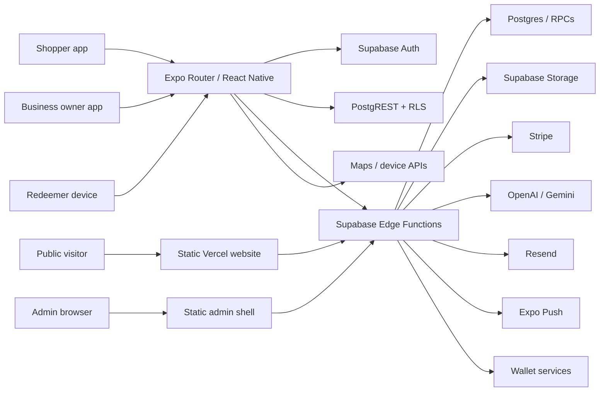

# System architecture and data flows

## System shape

## Trust boundaries

1. Mobile/browser inputs are untrusted; role, owner, business, source, price, deal status, and eligibility must be server-derived.
2. PostgREST is directly callable. RLS/database constraints are the final boundary even when the official app uses an Edge Function.
3. Service-role functions bypass RLS and must fully authorize callers and state transitions.
4. Stripe-signed events are external; server-selected Checkout configuration and webhook reconciliation must agree.
5. Anonymous RPC/form/link routes require narrow output, abuse controls, replay protection, and privacy-safe logs.
6. Static admin assets are public; session, role, MFA, section, and object authorization belong on the server.

## Critical data flows

| Flow | Entry | Server/data path | Expected authority | Result |
|---|---|---|---|---|
| Shopper auth | `app/auth-landing.tsx` | Auth + `profiles` | Auth identity/profile RLS | Client handles confirmation; hosted config unverified |
| Business signup | `app/business-setup.tsx` | invite RPC + business insert | scoped invitation/application review | F-003 shared client value |
| Browse/map | onboarding/map tabs | nearby RPC/direct fallback | approved public predicate | F-002 predicate missing |
| AI review/publish | `app/create/ai.tsx` | versioned AI + publish function | canonical publish policy | Official path checked; F-001 direct DB bypass |
| Claim/release | deal/wallet | claim/release functions | one grace-aware state machine | F-004 inconsistent expiration |
| Redemption | redeemer/staff UI | visual/token/staff functions | authorized device/role + valid claim | Auth failure paths close; device success path untested |
| Checkout | app/web | checkout token + Stripe function | server allowlist + atomic consume | F-005/F-006 |
| Webhook | Stripe | webhook + billing tables | signature, idempotency, expected product | Static controls present; live lifecycle untested |
| Admin | `/admin` | admin functions | session/role/MFA/sections | Unauth function probe 401; shell public |
| Share | share URL | `/s/<code>` + lookup | public-safe state-aware projection | F-009 website never resolves code |
| Delete account | settings | delete function | caller identity + complete cleanup | Present; destructive test blocked |

## Inventory

The repository contains 39 app TypeScript/TSX route/source files under `app/`, a static website/admin surface, 135 migrations, and 72 local Edge Function directories plus shared modules. The hosted project reports 73 active functions; `ai-refine-ad-copy` is the unmatched remote-only surface (F-013).

